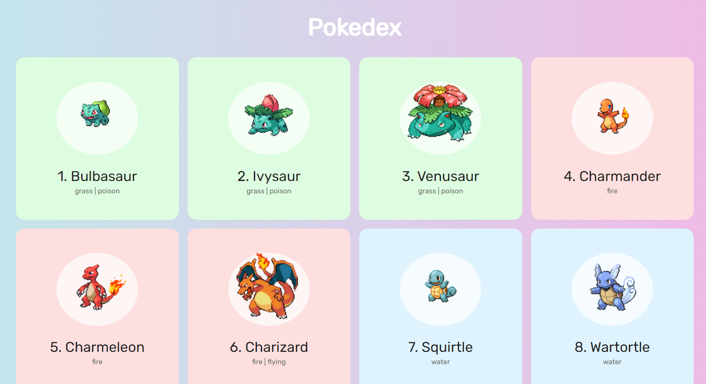

<h4 align="center"><a href="https://pokedex-zeta-eight.vercel.app/">Clique para visitar o projeto</a></h4>

## 🎯 Objetivo

Projeto desenvolvido através do tutorial do [Roger Melo](https://www.youtube.com/watch?v=Uptu3NrBFBM). Onde criamos uma Pokedex consumindo uma API ([PokeAPI](https://pokeapi.co/))

## 🛠️ Tecnologias utilizadas

Para o desenvolvimento deste site utilizei as seguintes tecnologias:

- HTML;
- CSS;
- JavaScript;
